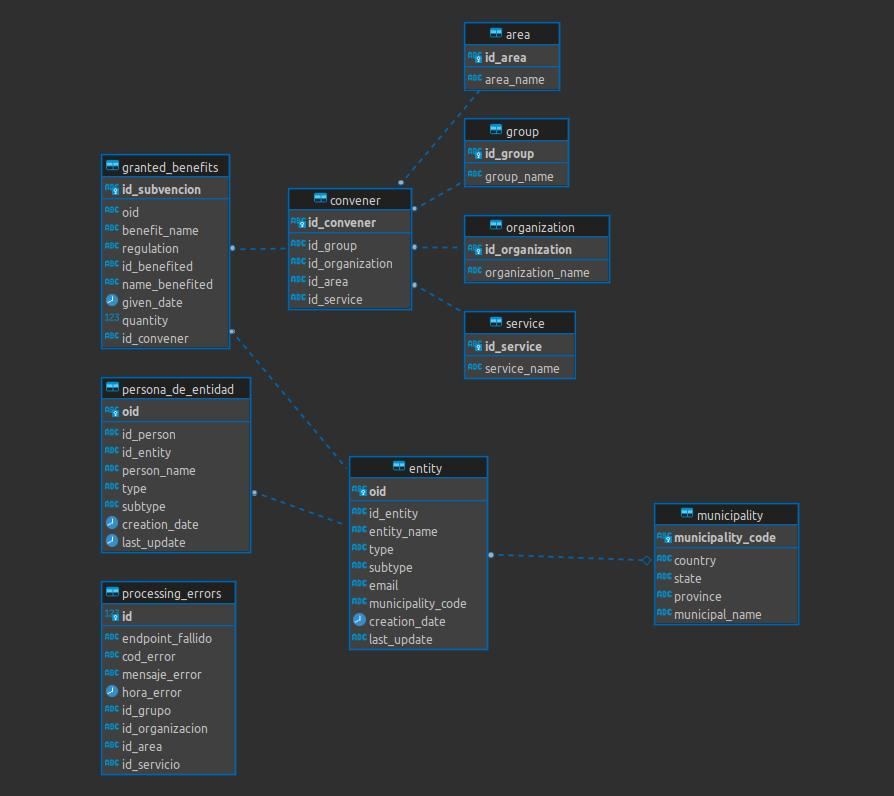

# AnalisisSubvenciones

La idea principal de este proyecto es utilizar los datos abiertos de subvenciones del País Vasco para detectar posibles subvenciones fraudulentas y lanzar alertas cuando esto pase.

## Etapa POC

El POC será una plataforma de análisis de subvenciones. Va a tener las entidades y personas a las que se les han otorgado estas subvenciones 

### **Extracción de datos:**

- **¿Qué vamos a extraer?**

    - <a href=' https://www.euskadi.eus/elecciones-municipales-juntas-generales-europeas-2019-2/-/elecciones-municipales-2019-relacion-de-alcaldesas-y-alcaldes-en-euskadi/'>**Alcaldes desde 2019**</a>: 
        - Código municipio
        - Nombre municipio
        - Nombre alcalde(sa)
        - Nombre de partido

    - <a href='https://opendata.euskadi.eus/api-directory/?api=directory'>**Entidades:**</a>
        - CIF/NIF
        - oid
        - ID Empresa
        - Nombre de empresa
        - Tipo de empresa
        - Subtipo de empresa
        - Información de contacto
        - Dirección de email
        - Personas principales de la empresa
        - Sector
        - País
        - Estado
        - Provincia
        - Municipio
        - Fecha de creación
        - Última actualización

    - <a href='https://opendata.euskadi.eus/api-directory/?api=directory'>**Personas:**</a>
        - oid
        - Nombre
        - ID Persona
        - Tipo
        - Subtipo
        - País
        - Estado
        - Provincia
        - Municipio
        - Creación
        - Última actualización
        - Entidades

    - <a href='https://opendata.euskadi.eus/api-granted-benefits/?api=granted-benefit/'>**Convener:**</a>
        - ID Grupo
        - Nombre Grupo
        - ID organización
        - Nombre organización
        - ID área
        - Nombre de área
        - ID servicio
        - Nombre servicio

    - <a href='https://opendata.euskadi.eus/api-granted-benefits/'>**Beneficios otorgados:**</a>
        - oid
        - ID beneficio
        - Nombre
        - Regulación
        - Datos del convener (ver arriba)
        - Datos de la organización (ver arriba)
        - Datos del área (ver arriba)
        - Datos del servicio (ver arriba)
        - ID Beneficiado (su DNI o CIF si es una empresa)
        - Nombre beneficiado
        - Fecha garantizado
        - cantidad

    - <a href='https://opendata.euskadi.eus/api-administration/?api=administration_events'>**Eventos admin:**</a>
        - ok

## **Modelo de Datos:**

### **Directorio y Beneficios**:

### **Herramientas Útiles:**
  - <a href='https://infocif.economia3.com'>Nombre de empresa a CIF/NIF</a> 

### **2. Almacenamiento:**